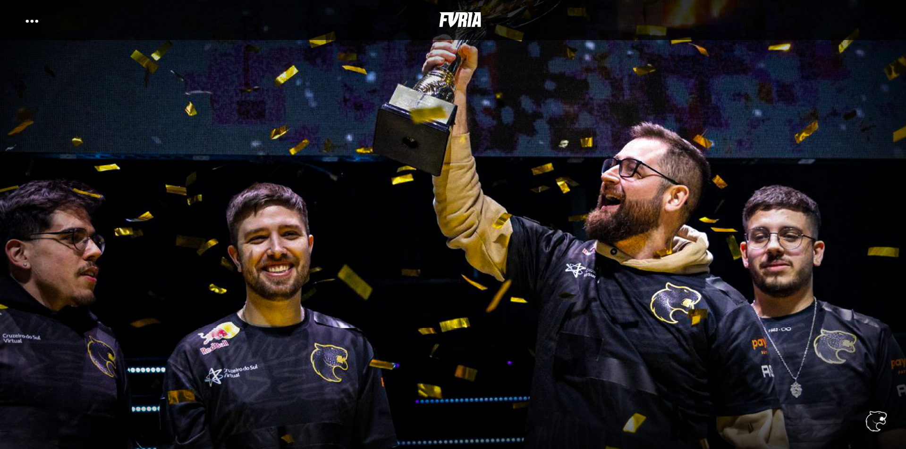
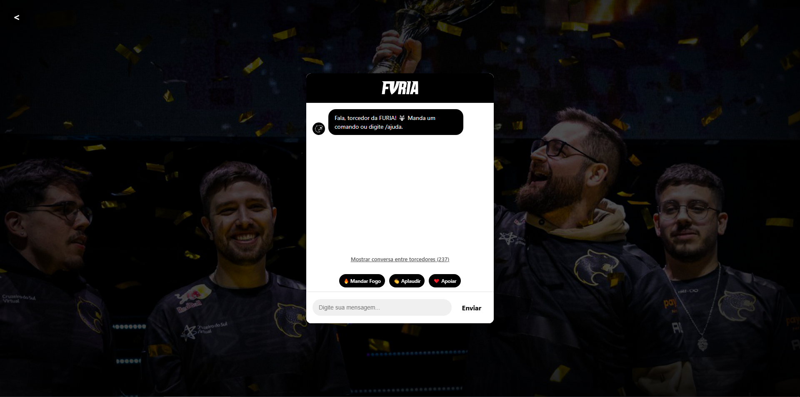

# FURIA ChatBot





## 🐾 Sobre o Projeto

Esta é uma plataforma interativa para fãs de e-sports da FURIA que simula uma experiência de jogo ao vivo com bate-papo em tempo real entre os fãs. O aplicativo fornece informações sobre os jogadores do time, as próximas partidas e recursos divertidos, como quizzes, para testar o conhecimento dos fãs sobre o time.

### Características

- **Simulação de partida ao vivo**: Experimente a emoção de uma partida FURIA com atualizações de pontuação em tempo real
- **Fan Chat**: Interaja com outros fãs durante as partidas
- **Informações do jogador**: Acesse informações detalhadas sobre cada jogador FURIA
- **Quiz interativo**: Teste seus conhecimentos sobre FURIA com nosso quiz
- **Comandos rápidos** : Acesso fácil a informações sobre partidas, jogadores e muito mais

## 🚀 Começando

### Pré-requisitos

- Node.js (v14.0.0 ou posterior)
- npm (v6.0.0 ou posterior)

### Instalação

1. Clonar o repositório
   ```sh
   git clone https://github.com/your-username/furia-fan-platform.git
   ```

2. Navegue até o diretório do projeto
   ```sh
   cd furia-fan-platform
   ```

3. Instalar pacotes NPM
   ```sh
   npm install
   ```

4. Inicie o servidor de desenvolvimento
   ```sh
   npm start
   ```

## 🛠️ Construído com

- [React](https://reactjs.org/) - Biblioteca JavaScript para construção de interfaces de usuário
- [Styled Components](https://styled-components.com/) - Para estilização específica de componentes

## 📁 Estrutura do Projeto

```
src/
├── assets/           # Images and static assets
├── components/       # React components
│   ├── ChatWindow/   # Chat interface components
│   ├── FuriaSite/    # Main site components
│   ├── Message/      # Message display components
│   └── Modal/        # Modal display for player information
└── App.js            # Main application component
```

## 📋 Comandos disponíveis

A janela de bate-papo responde a estes comandos:

- `/ajuda` - Exibir comandos disponíveis
- `/jogos` - Mostrar partidas futuras
- `/elenco` - Exibir a escalação atual da equipe
- `/curiosidade` - Fatos aleatórios sobre FURIA
- `/news` - Últimas notícias da equipe
- `/grito` - Envie uma mensagem de alegria
- `/loja` - Obtenha um link para a loja de produtos da equipe
- `/quiz` - Comece um quiz sobre FURIA
- `/jogador [nome]` - Obter informações sobre um jogador específico

## 🎮 Como funciona

A plataforma simula uma experiência de partida ao vivo com:

1. **Simulação de partida**: Uma partida começa logo após a abertura do chat, com atualizações de pontuação a cada poucos minutos
2. **Bate-papo ao vivo com os fãs**: Mensagens de outros fãs (simuladas) aparecem em tempo real durante a partida
3. **Elementos interativos**: Botões de torcida, perguntas do quiz e cartões de informações do jogador

## 👥 Equipe

- Desenvolvedor: [Gian Carlos Megiolaro] (https://github.com/Megiolaro)

## 📞 Contact

Gian Carlos Megiolaro - giancarlosmegiolaro@gmail.com

Project Link: [https://github.com/Megiolaro/furia-chat](https://github.com/Megiolaro/furia-chat)

## 🙏 Acknowledgments

- [FURIA Esports](https://furia.gg/) pela oportunidade
- Todos os jogadores e fãs da FURIA em todo o mundo